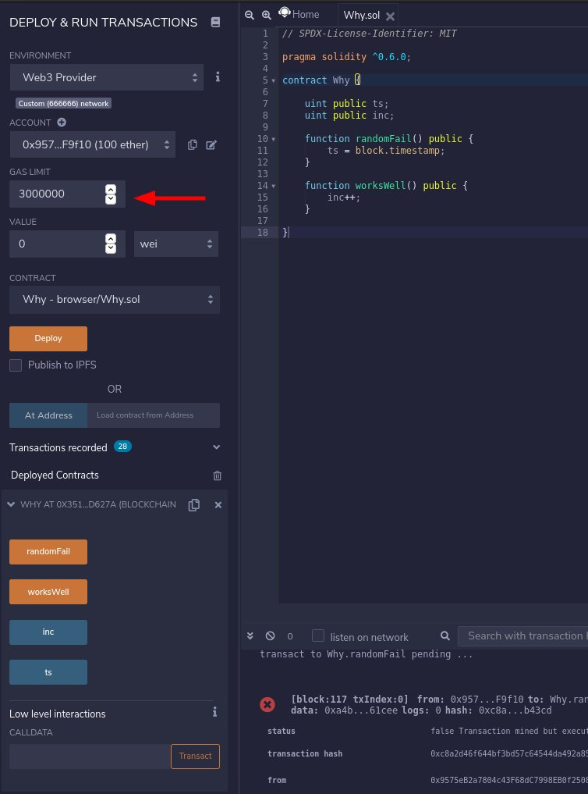
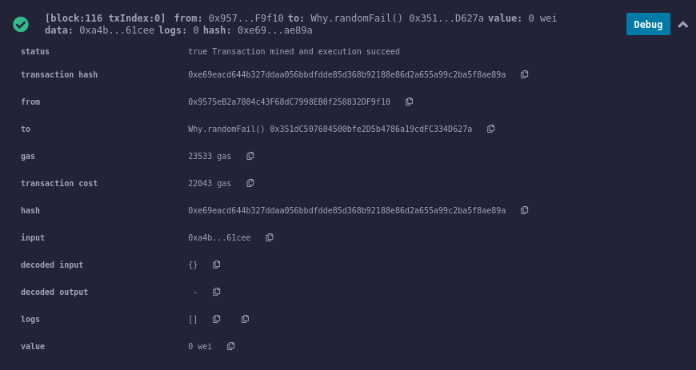
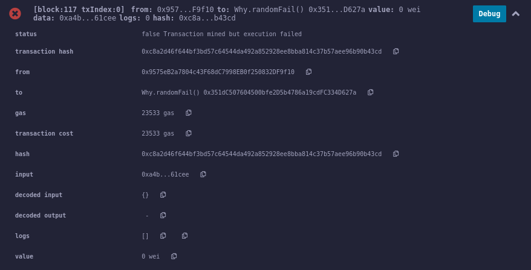
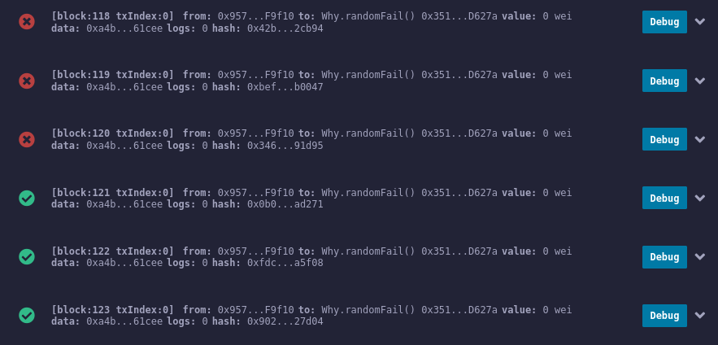

# The problem

While testing my contract, I noticed that multiple contract calls that assign `block.timestamp` to a storage variable fail randomly.

The contract:

```solidity
contract Why {

    uint public ts;

    function randomFail() public {
        ts = block.timestamp;
    }

}
```

The test:

```node
const Why = await ethers.getContractFactory("Why");
const why = await Why.deploy();
await why.deployed();

for (let i = 0; i < 100; i++) {
  const tx = await why.randomFail();
  try {
    await tx.wait();
  } catch (e) {
    console.log("FAILED!!!");
    console.log(e);
  }
}
```

The test environment runs `geth` in development mode (see [ethnode](https://github.com/vrde/ethnode/)). While a tight loop like this is unrealistic in production environments (mainnet/xdai/whatev) I'm quite puzzled on how this can fail to be honest.

## How to reproduce


```
npm install
npm run ethnode

# In a new shell
npm test
```

By running the tests you shuold see many failures.

## What you should see

If you run the test suite, you shuold see something like the following log. It happened to me that few executions **didn't** generate any failure (I don't have any stats, but it was like 3 or 4 runs over **many**). **For the trace of the transaction see below**.

```
> solidity-why@1.0.0 test /home/codespace/workspace/solidity-why
> hardhat test --network localhost


  Why
FAILED!!!
Error: transaction failed (transactionHash="0x376816ef0881b669d774e7ecd4cbb62f8472e148985788ab5561c8c41c292181", transaction={"hash":"0x376816ef0881b669d774e7ecd4cbb62f8472e148985788ab5561c8c41c292181","blockHash":"0xb5edc18e8b6611e19099d4297b36da9505cd1c58fb231dec2342615d3d6caf1c","blockNumber":612,"transactionIndex":0,"confirmations":1,"from":"0x9575eB2a7804c43F68dC7998EB0f250832DF9f10","gasPrice":{"type":"BigNumber","hex":"0x3b9aca00"},"gasLimit":{"type":"BigNumber","hex":"0x5bed"},"to":"0x25A76Af6C005f1F16eb3cF0fF99243F715b66BF9","value":{"type":"BigNumber","hex":"0x00"},"nonce":611,"data":"0xa4b61cee","r":"0x4b876c2f32f1b7ba4879be504907e59d371819e468b44b7676292b4f05b03d88","s":"0x480423226b5c43a0606f485249e192b7b505c7fe08ef4c56dee64756976550d8","v":1333368,"creates":null,"chainId":666666}, receipt={"to":"0x25A76Af6C005f1F16eb3cF0fF99243F715b66BF9","from":"0x9575eB2a7804c43F68dC7998EB0f250832DF9f10","contractAddress":null,"transactionIndex":0,"gasUsed":{"type":"BigNumber","hex":"0x5bed"},"logsBloom":"0x00000000000000000000000000000000000000000000000000000000000000000000000000000000000000000000000000000000000000000000000000000000000000000000000000000000000000000000000000000000000000000000000000000000000000000000000000000000000000000000000000000000000000000000000000000000000000000000000000000000000000000000000000000000000000000000000000000000000000000000000000000000000000000000000000000000000000000000000000000000000000000000000000000000000000000000000000000000000000000000000000000000000000000000000000000000","blockHash":"0xb5edc18e8b6611e19099d4297b36da9505cd1c58fb231dec2342615d3d6caf1c","transactionHash":"0x376816ef0881b669d774e7ecd4cbb62f8472e148985788ab5561c8c41c292181","logs":[],"blockNumber":612,"confirmations":1,"cumulativeGasUsed":{"type":"BigNumber","hex":"0x5bed"},"status":0,"byzantium":true}, code=CALL_EXCEPTION, version=providers/5.0.23)
    at Logger.makeError (/home/codespace/workspace/solidity-why/node_modules/@ethersproject/logger/src.ts/index.ts:205:28)
    at Logger.throwError (/home/codespace/workspace/solidity-why/node_modules/@ethersproject/logger/src.ts/index.ts:217:20)
    at EthersProviderWrapper.<anonymous> (/home/codespace/workspace/solidity-why/node_modules/@ethersproject/providers/src.ts/base-provider.ts:1084:24)
    at step (/home/codespace/workspace/solidity-why/node_modules/@ethersproject/providers/lib/base-provider.js:46:23)
    at Object.next (/home/codespace/workspace/solidity-why/node_modules/@ethersproject/providers/lib/base-provider.js:27:53)
    at fulfilled (/home/codespace/workspace/solidity-why/node_modules/@ethersproject/providers/lib/base-provider.js:18:58)
    at processTicksAndRejections (internal/process/task_queues.js:93:5) {
  reason: 'transaction failed',
  code: 'CALL_EXCEPTION',
  transactionHash: '0x376816ef0881b669d774e7ecd4cbb62f8472e148985788ab5561c8c41c292181',
  transaction: {
    hash: '0x376816ef0881b669d774e7ecd4cbb62f8472e148985788ab5561c8c41c292181',
    blockHash: '0xb5edc18e8b6611e19099d4297b36da9505cd1c58fb231dec2342615d3d6caf1c',
    blockNumber: 612,
    transactionIndex: 0,
    confirmations: 1,
    from: '0x9575eB2a7804c43F68dC7998EB0f250832DF9f10',
    gasPrice: BigNumber { _hex: '0x3b9aca00', _isBigNumber: true },
    gasLimit: BigNumber { _hex: '0x5bed', _isBigNumber: true },
    to: '0x25A76Af6C005f1F16eb3cF0fF99243F715b66BF9',
    value: BigNumber { _hex: '0x00', _isBigNumber: true },
    nonce: 611,
    data: '0xa4b61cee',
    r: '0x4b876c2f32f1b7ba4879be504907e59d371819e468b44b7676292b4f05b03d88',
    s: '0x480423226b5c43a0606f485249e192b7b505c7fe08ef4c56dee64756976550d8',
    v: 1333368,
    creates: null,
    chainId: 666666,
    wait: [Function (anonymous)]
  },
  receipt: {
    to: '0x25A76Af6C005f1F16eb3cF0fF99243F715b66BF9',
    from: '0x9575eB2a7804c43F68dC7998EB0f250832DF9f10',
    contractAddress: null,
    transactionIndex: 0,
    gasUsed: BigNumber { _hex: '0x5bed', _isBigNumber: true },
    logsBloom: '0x00000000000000000000000000000000000000000000000000000000000000000000000000000000000000000000000000000000000000000000000000000000000000000000000000000000000000000000000000000000000000000000000000000000000000000000000000000000000000000000000000000000000000000000000000000000000000000000000000000000000000000000000000000000000000000000000000000000000000000000000000000000000000000000000000000000000000000000000000000000000000000000000000000000000000000000000000000000000000000000000000000000000000000000000000000000',
    blockHash: '0xb5edc18e8b6611e19099d4297b36da9505cd1c58fb231dec2342615d3d6caf1c',
    transactionHash: '0x376816ef0881b669d774e7ecd4cbb62f8472e148985788ab5561c8c41c292181',
    logs: [],
    blockNumber: 612,
    confirmations: 1,
    cumulativeGasUsed: BigNumber { _hex: '0x5bed', _isBigNumber: true },
    status: 0,
    byzantium: true
  }
}
FAILED!!!
Error: transaction failed (transactionHash="0x1f49529674204db74737fea26f87be3d8de94c1006a90a9e54d830a1ee88dc69", transaction={"hash":"0x1f49529674204db74737fea26f87be3d8de94c1006a90a9e54d830a1ee88dc69","blockHash":"0xf9b65bec5d0d3d9c7b7876327b421d8372ba9d057ef17813ceb713dc581b9e1a","blockNumber":674,"transactionIndex":0,"confirmations":1,"from":"0x9575eB2a7804c43F68dC7998EB0f250832DF9f10","gasPrice":{"type":"BigNumber","hex":"0x3b9aca00"},"gasLimit":{"type":"BigNumber","hex":"0x5bed"},"to":"0x25A76Af6C005f1F16eb3cF0fF99243F715b66BF9","value":{"type":"BigNumber","hex":"0x00"},"nonce":673,"data":"0xa4b61cee","r":"0x841222a95a84541f405ac5b9b2da53f805b90cf9e1964204030828e02b364de2","s":"0x25756fdf9538e67d030c31f2f30d24c144f3576dec8ab6eb017917369f04f0bd","v":1333367,"creates":null,"chainId":666666}, receipt={"to":"0x25A76Af6C005f1F16eb3cF0fF99243F715b66BF9","from":"0x9575eB2a7804c43F68dC7998EB0f250832DF9f10","contractAddress":null,"transactionIndex":0,"gasUsed":{"type":"BigNumber","hex":"0x5bed"},"logsBloom":"0x00000000000000000000000000000000000000000000000000000000000000000000000000000000000000000000000000000000000000000000000000000000000000000000000000000000000000000000000000000000000000000000000000000000000000000000000000000000000000000000000000000000000000000000000000000000000000000000000000000000000000000000000000000000000000000000000000000000000000000000000000000000000000000000000000000000000000000000000000000000000000000000000000000000000000000000000000000000000000000000000000000000000000000000000000000000","blockHash":"0xf9b65bec5d0d3d9c7b7876327b421d8372ba9d057ef17813ceb713dc581b9e1a","transactionHash":"0x1f49529674204db74737fea26f87be3d8de94c1006a90a9e54d830a1ee88dc69","logs":[],"blockNumber":674,"confirmations":1,"cumulativeGasUsed":{"type":"BigNumber","hex":"0x5bed"},"status":0,"byzantium":true}, code=CALL_EXCEPTION, version=providers/5.0.23)
    at Logger.makeError (/home/codespace/workspace/solidity-why/node_modules/@ethersproject/logger/src.ts/index.ts:205:28)
    at Logger.throwError (/home/codespace/workspace/solidity-why/node_modules/@ethersproject/logger/src.ts/index.ts:217:20)
    at EthersProviderWrapper.<anonymous> (/home/codespace/workspace/solidity-why/node_modules/@ethersproject/providers/src.ts/base-provider.ts:1084:24)
    at step (/home/codespace/workspace/solidity-why/node_modules/@ethersproject/providers/lib/base-provider.js:46:23)
    at Object.next (/home/codespace/workspace/solidity-why/node_modules/@ethersproject/providers/lib/base-provider.js:27:53)
    at fulfilled (/home/codespace/workspace/solidity-why/node_modules/@ethersproject/providers/lib/base-provider.js:18:58)
    at runMicrotasks (<anonymous>)
    at processTicksAndRejections (internal/process/task_queues.js:93:5) {
  reason: 'transaction failed',
  code: 'CALL_EXCEPTION',
  transactionHash: '0x1f49529674204db74737fea26f87be3d8de94c1006a90a9e54d830a1ee88dc69',
  transaction: {
    hash: '0x1f49529674204db74737fea26f87be3d8de94c1006a90a9e54d830a1ee88dc69',
    blockHash: '0xf9b65bec5d0d3d9c7b7876327b421d8372ba9d057ef17813ceb713dc581b9e1a',
    blockNumber: 674,
    transactionIndex: 0,
    confirmations: 1,
    from: '0x9575eB2a7804c43F68dC7998EB0f250832DF9f10',
    gasPrice: BigNumber { _hex: '0x3b9aca00', _isBigNumber: true },
    gasLimit: BigNumber { _hex: '0x5bed', _isBigNumber: true },
    to: '0x25A76Af6C005f1F16eb3cF0fF99243F715b66BF9',
    value: BigNumber { _hex: '0x00', _isBigNumber: true },
    nonce: 673,
    data: '0xa4b61cee',
    r: '0x841222a95a84541f405ac5b9b2da53f805b90cf9e1964204030828e02b364de2',
    s: '0x25756fdf9538e67d030c31f2f30d24c144f3576dec8ab6eb017917369f04f0bd',
    v: 1333367,
    creates: null,
    chainId: 666666,
    wait: [Function (anonymous)]
  },
  receipt: {
    to: '0x25A76Af6C005f1F16eb3cF0fF99243F715b66BF9',
    from: '0x9575eB2a7804c43F68dC7998EB0f250832DF9f10',
    contractAddress: null,
    transactionIndex: 0,
    gasUsed: BigNumber { _hex: '0x5bed', _isBigNumber: true },
    logsBloom: '0x00000000000000000000000000000000000000000000000000000000000000000000000000000000000000000000000000000000000000000000000000000000000000000000000000000000000000000000000000000000000000000000000000000000000000000000000000000000000000000000000000000000000000000000000000000000000000000000000000000000000000000000000000000000000000000000000000000000000000000000000000000000000000000000000000000000000000000000000000000000000000000000000000000000000000000000000000000000000000000000000000000000000000000000000000000000',
    blockHash: '0xf9b65bec5d0d3d9c7b7876327b421d8372ba9d057ef17813ceb713dc581b9e1a',
    transactionHash: '0x1f49529674204db74737fea26f87be3d8de94c1006a90a9e54d830a1ee88dc69',
    logs: [],
    blockNumber: 674,
    confirmations: 1,
    cumulativeGasUsed: BigNumber { _hex: '0x5bed', _isBigNumber: true },
    status: 0,
    byzantium: true
  }
}
    ✓ Should randomly fail on assigning block.timestamp to a variable (1562ms)
    ✓ Should not fail on incrementing a variable (1461ms)


  2 passing (3s)
```

## Trace of a failed transaction

*Thanks [chriseth](https://github.com/chriseth) for the suggestion.*

```json
{
  "jsonrpc": "2.0",
  "id": 1,
  "result": {
    "gas": 23533,
    "failed": true,
    "returnValue": "",
    "structLogs": [
      {
        "pc": 0,
        "op": "PUSH1",
        "gas": 2469,
        "gasCost": 3,
        "depth": 1,
        "stack": [],
        "memory": [],
        "storage": {}
      },
      {
        "pc": 2,
        "op": "PUSH1",
        "gas": 2466,
        "gasCost": 3,
        "depth": 1,
        "stack": [
          "0000000000000000000000000000000000000000000000000000000000000080"
        ],
        "memory": [],
        "storage": {}
      },
      {
        "pc": 4,
        "op": "MSTORE",
        "gas": 2463,
        "gasCost": 12,
        "depth": 1,
        "stack": [
          "0000000000000000000000000000000000000000000000000000000000000080",
          "0000000000000000000000000000000000000000000000000000000000000040"
        ],
        "memory": [
          "0000000000000000000000000000000000000000000000000000000000000000",
          "0000000000000000000000000000000000000000000000000000000000000000",
          "0000000000000000000000000000000000000000000000000000000000000000"
        ],
        "storage": {}
      },
      {
        "pc": 5,
        "op": "CALLVALUE",
        "gas": 2451,
        "gasCost": 2,
        "depth": 1,
        "stack": [],
        "memory": [
          "0000000000000000000000000000000000000000000000000000000000000000",
          "0000000000000000000000000000000000000000000000000000000000000000",
          "0000000000000000000000000000000000000000000000000000000000000080"
        ],
        "storage": {}
      },
      {
        "pc": 6,
        "op": "DUP1",
        "gas": 2449,
        "gasCost": 3,
        "depth": 1,
        "stack": [
          "0000000000000000000000000000000000000000000000000000000000000000"
        ],
        "memory": [
          "0000000000000000000000000000000000000000000000000000000000000000",
          "0000000000000000000000000000000000000000000000000000000000000000",
          "0000000000000000000000000000000000000000000000000000000000000080"
        ],
        "storage": {}
      },
      {
        "pc": 7,
        "op": "ISZERO",
        "gas": 2446,
        "gasCost": 3,
        "depth": 1,
        "stack": [
          "0000000000000000000000000000000000000000000000000000000000000000",
          "0000000000000000000000000000000000000000000000000000000000000000"
        ],
        "memory": [
          "0000000000000000000000000000000000000000000000000000000000000000",
          "0000000000000000000000000000000000000000000000000000000000000000",
          "0000000000000000000000000000000000000000000000000000000000000080"
        ],
        "storage": {}
      },
      {
        "pc": 8,
        "op": "PUSH1",
        "gas": 2443,
        "gasCost": 3,
        "depth": 1,
        "stack": [
          "0000000000000000000000000000000000000000000000000000000000000000",
          "0000000000000000000000000000000000000000000000000000000000000001"
        ],
        "memory": [
          "0000000000000000000000000000000000000000000000000000000000000000",
          "0000000000000000000000000000000000000000000000000000000000000000",
          "0000000000000000000000000000000000000000000000000000000000000080"
        ],
        "storage": {}
      },
      {
        "pc": 10,
        "op": "JUMPI",
        "gas": 2440,
        "gasCost": 10,
        "depth": 1,
        "stack": [
          "0000000000000000000000000000000000000000000000000000000000000000",
          "0000000000000000000000000000000000000000000000000000000000000001",
          "000000000000000000000000000000000000000000000000000000000000000f"
        ],
        "memory": [
          "0000000000000000000000000000000000000000000000000000000000000000",
          "0000000000000000000000000000000000000000000000000000000000000000",
          "0000000000000000000000000000000000000000000000000000000000000080"
        ],
        "storage": {}
      },
      {
        "pc": 15,
        "op": "JUMPDEST",
        "gas": 2430,
        "gasCost": 1,
        "depth": 1,
        "stack": [
          "0000000000000000000000000000000000000000000000000000000000000000"
        ],
        "memory": [
          "0000000000000000000000000000000000000000000000000000000000000000",
          "0000000000000000000000000000000000000000000000000000000000000000",
          "0000000000000000000000000000000000000000000000000000000000000080"
        ],
        "storage": {}
      },
      {
        "pc": 16,
        "op": "POP",
        "gas": 2429,
        "gasCost": 2,
        "depth": 1,
        "stack": [
          "0000000000000000000000000000000000000000000000000000000000000000"
        ],
        "memory": [
          "0000000000000000000000000000000000000000000000000000000000000000",
          "0000000000000000000000000000000000000000000000000000000000000000",
          "0000000000000000000000000000000000000000000000000000000000000080"
        ],
        "storage": {}
      },
      {
        "pc": 17,
        "op": "PUSH1",
        "gas": 2427,
        "gasCost": 3,
        "depth": 1,
        "stack": [],
        "memory": [
          "0000000000000000000000000000000000000000000000000000000000000000",
          "0000000000000000000000000000000000000000000000000000000000000000",
          "0000000000000000000000000000000000000000000000000000000000000080"
        ],
        "storage": {}
      },
      {
        "pc": 19,
        "op": "CALLDATASIZE",
        "gas": 2424,
        "gasCost": 2,
        "depth": 1,
        "stack": [
          "0000000000000000000000000000000000000000000000000000000000000004"
        ],
        "memory": [
          "0000000000000000000000000000000000000000000000000000000000000000",
          "0000000000000000000000000000000000000000000000000000000000000000",
          "0000000000000000000000000000000000000000000000000000000000000080"
        ],
        "storage": {}
      },
      {
        "pc": 20,
        "op": "LT",
        "gas": 2422,
        "gasCost": 3,
        "depth": 1,
        "stack": [
          "0000000000000000000000000000000000000000000000000000000000000004",
          "0000000000000000000000000000000000000000000000000000000000000004"
        ],
        "memory": [
          "0000000000000000000000000000000000000000000000000000000000000000",
          "0000000000000000000000000000000000000000000000000000000000000000",
          "0000000000000000000000000000000000000000000000000000000000000080"
        ],
        "storage": {}
      },
      {
        "pc": 21,
        "op": "PUSH1",
        "gas": 2419,
        "gasCost": 3,
        "depth": 1,
        "stack": [
          "0000000000000000000000000000000000000000000000000000000000000000"
        ],
        "memory": [
          "0000000000000000000000000000000000000000000000000000000000000000",
          "0000000000000000000000000000000000000000000000000000000000000000",
          "0000000000000000000000000000000000000000000000000000000000000080"
        ],
        "storage": {}
      },
      {
        "pc": 23,
        "op": "JUMPI",
        "gas": 2416,
        "gasCost": 10,
        "depth": 1,
        "stack": [
          "0000000000000000000000000000000000000000000000000000000000000000",
          "0000000000000000000000000000000000000000000000000000000000000046"
        ],
        "memory": [
          "0000000000000000000000000000000000000000000000000000000000000000",
          "0000000000000000000000000000000000000000000000000000000000000000",
          "0000000000000000000000000000000000000000000000000000000000000080"
        ],
        "storage": {}
      },
      {
        "pc": 24,
        "op": "PUSH1",
        "gas": 2406,
        "gasCost": 3,
        "depth": 1,
        "stack": [],
        "memory": [
          "0000000000000000000000000000000000000000000000000000000000000000",
          "0000000000000000000000000000000000000000000000000000000000000000",
          "0000000000000000000000000000000000000000000000000000000000000080"
        ],
        "storage": {}
      },
      {
        "pc": 26,
        "op": "CALLDATALOAD",
        "gas": 2403,
        "gasCost": 3,
        "depth": 1,
        "stack": [
          "0000000000000000000000000000000000000000000000000000000000000000"
        ],
        "memory": [
          "0000000000000000000000000000000000000000000000000000000000000000",
          "0000000000000000000000000000000000000000000000000000000000000000",
          "0000000000000000000000000000000000000000000000000000000000000080"
        ],
        "storage": {}
      },
      {
        "pc": 27,
        "op": "PUSH1",
        "gas": 2400,
        "gasCost": 3,
        "depth": 1,
        "stack": [
          "a4b61cee00000000000000000000000000000000000000000000000000000000"
        ],
        "memory": [
          "0000000000000000000000000000000000000000000000000000000000000000",
          "0000000000000000000000000000000000000000000000000000000000000000",
          "0000000000000000000000000000000000000000000000000000000000000080"
        ],
        "storage": {}
      },
      {
        "pc": 29,
        "op": "SHR",
        "gas": 2397,
        "gasCost": 3,
        "depth": 1,
        "stack": [
          "a4b61cee00000000000000000000000000000000000000000000000000000000",
          "00000000000000000000000000000000000000000000000000000000000000e0"
        ],
        "memory": [
          "0000000000000000000000000000000000000000000000000000000000000000",
          "0000000000000000000000000000000000000000000000000000000000000000",
          "0000000000000000000000000000000000000000000000000000000000000080"
        ],
        "storage": {}
      },
      {
        "pc": 30,
        "op": "DUP1",
        "gas": 2394,
        "gasCost": 3,
        "depth": 1,
        "stack": [
          "00000000000000000000000000000000000000000000000000000000a4b61cee"
        ],
        "memory": [
          "0000000000000000000000000000000000000000000000000000000000000000",
          "0000000000000000000000000000000000000000000000000000000000000000",
          "0000000000000000000000000000000000000000000000000000000000000080"
        ],
        "storage": {}
      },
      {
        "pc": 31,
        "op": "PUSH4",
        "gas": 2391,
        "gasCost": 3,
        "depth": 1,
        "stack": [
          "00000000000000000000000000000000000000000000000000000000a4b61cee",
          "00000000000000000000000000000000000000000000000000000000a4b61cee"
        ],
        "memory": [
          "0000000000000000000000000000000000000000000000000000000000000000",
          "0000000000000000000000000000000000000000000000000000000000000000",
          "0000000000000000000000000000000000000000000000000000000000000080"
        ],
        "storage": {}
      },
      {
        "pc": 36,
        "op": "EQ",
        "gas": 2388,
        "gasCost": 3,
        "depth": 1,
        "stack": [
          "00000000000000000000000000000000000000000000000000000000a4b61cee",
          "00000000000000000000000000000000000000000000000000000000a4b61cee",
          "00000000000000000000000000000000000000000000000000000000121a2548"
        ],
        "memory": [
          "0000000000000000000000000000000000000000000000000000000000000000",
          "0000000000000000000000000000000000000000000000000000000000000000",
          "0000000000000000000000000000000000000000000000000000000000000080"
        ],
        "storage": {}
      },
      {
        "pc": 37,
        "op": "PUSH1",
        "gas": 2385,
        "gasCost": 3,
        "depth": 1,
        "stack": [
          "00000000000000000000000000000000000000000000000000000000a4b61cee",
          "0000000000000000000000000000000000000000000000000000000000000000"
        ],
        "memory": [
          "0000000000000000000000000000000000000000000000000000000000000000",
          "0000000000000000000000000000000000000000000000000000000000000000",
          "0000000000000000000000000000000000000000000000000000000000000080"
        ],
        "storage": {}
      },
      {
        "pc": 39,
        "op": "JUMPI",
        "gas": 2382,
        "gasCost": 10,
        "depth": 1,
        "stack": [
          "00000000000000000000000000000000000000000000000000000000a4b61cee",
          "0000000000000000000000000000000000000000000000000000000000000000",
          "000000000000000000000000000000000000000000000000000000000000004b"
        ],
        "memory": [
          "0000000000000000000000000000000000000000000000000000000000000000",
          "0000000000000000000000000000000000000000000000000000000000000000",
          "0000000000000000000000000000000000000000000000000000000000000080"
        ],
        "storage": {}
      },
      {
        "pc": 40,
        "op": "DUP1",
        "gas": 2372,
        "gasCost": 3,
        "depth": 1,
        "stack": [
          "00000000000000000000000000000000000000000000000000000000a4b61cee"
        ],
        "memory": [
          "0000000000000000000000000000000000000000000000000000000000000000",
          "0000000000000000000000000000000000000000000000000000000000000000",
          "0000000000000000000000000000000000000000000000000000000000000080"
        ],
        "storage": {}
      },
      {
        "pc": 41,
        "op": "PUSH4",
        "gas": 2369,
        "gasCost": 3,
        "depth": 1,
        "stack": [
          "00000000000000000000000000000000000000000000000000000000a4b61cee",
          "00000000000000000000000000000000000000000000000000000000a4b61cee"
        ],
        "memory": [
          "0000000000000000000000000000000000000000000000000000000000000000",
          "0000000000000000000000000000000000000000000000000000000000000000",
          "0000000000000000000000000000000000000000000000000000000000000080"
        ],
        "storage": {}
      },
      {
        "pc": 46,
        "op": "EQ",
        "gas": 2366,
        "gasCost": 3,
        "depth": 1,
        "stack": [
          "00000000000000000000000000000000000000000000000000000000a4b61cee",
          "00000000000000000000000000000000000000000000000000000000a4b61cee",
          "00000000000000000000000000000000000000000000000000000000371303c0"
        ],
        "memory": [
          "0000000000000000000000000000000000000000000000000000000000000000",
          "0000000000000000000000000000000000000000000000000000000000000000",
          "0000000000000000000000000000000000000000000000000000000000000080"
        ],
        "storage": {}
      },
      {
        "pc": 47,
        "op": "PUSH1",
        "gas": 2363,
        "gasCost": 3,
        "depth": 1,
        "stack": [
          "00000000000000000000000000000000000000000000000000000000a4b61cee",
          "0000000000000000000000000000000000000000000000000000000000000000"
        ],
        "memory": [
          "0000000000000000000000000000000000000000000000000000000000000000",
          "0000000000000000000000000000000000000000000000000000000000000000",
          "0000000000000000000000000000000000000000000000000000000000000080"
        ],
        "storage": {}
      },
      {
        "pc": 49,
        "op": "JUMPI",
        "gas": 2360,
        "gasCost": 10,
        "depth": 1,
        "stack": [
          "00000000000000000000000000000000000000000000000000000000a4b61cee",
          "0000000000000000000000000000000000000000000000000000000000000000",
          "0000000000000000000000000000000000000000000000000000000000000053"
        ],
        "memory": [
          "0000000000000000000000000000000000000000000000000000000000000000",
          "0000000000000000000000000000000000000000000000000000000000000000",
          "0000000000000000000000000000000000000000000000000000000000000080"
        ],
        "storage": {}
      },
      {
        "pc": 50,
        "op": "DUP1",
        "gas": 2350,
        "gasCost": 3,
        "depth": 1,
        "stack": [
          "00000000000000000000000000000000000000000000000000000000a4b61cee"
        ],
        "memory": [
          "0000000000000000000000000000000000000000000000000000000000000000",
          "0000000000000000000000000000000000000000000000000000000000000000",
          "0000000000000000000000000000000000000000000000000000000000000080"
        ],
        "storage": {}
      },
      {
        "pc": 51,
        "op": "PUSH4",
        "gas": 2347,
        "gasCost": 3,
        "depth": 1,
        "stack": [
          "00000000000000000000000000000000000000000000000000000000a4b61cee",
          "00000000000000000000000000000000000000000000000000000000a4b61cee"
        ],
        "memory": [
          "0000000000000000000000000000000000000000000000000000000000000000",
          "0000000000000000000000000000000000000000000000000000000000000000",
          "0000000000000000000000000000000000000000000000000000000000000080"
        ],
        "storage": {}
      },
      {
        "pc": 56,
        "op": "EQ",
        "gas": 2344,
        "gasCost": 3,
        "depth": 1,
        "stack": [
          "00000000000000000000000000000000000000000000000000000000a4b61cee",
          "00000000000000000000000000000000000000000000000000000000a4b61cee",
          "00000000000000000000000000000000000000000000000000000000a4b61cee"
        ],
        "memory": [
          "0000000000000000000000000000000000000000000000000000000000000000",
          "0000000000000000000000000000000000000000000000000000000000000000",
          "0000000000000000000000000000000000000000000000000000000000000080"
        ],
        "storage": {}
      },
      {
        "pc": 57,
        "op": "PUSH1",
        "gas": 2341,
        "gasCost": 3,
        "depth": 1,
        "stack": [
          "00000000000000000000000000000000000000000000000000000000a4b61cee",
          "0000000000000000000000000000000000000000000000000000000000000001"
        ],
        "memory": [
          "0000000000000000000000000000000000000000000000000000000000000000",
          "0000000000000000000000000000000000000000000000000000000000000000",
          "0000000000000000000000000000000000000000000000000000000000000080"
        ],
        "storage": {}
      },
      {
        "pc": 59,
        "op": "JUMPI",
        "gas": 2338,
        "gasCost": 10,
        "depth": 1,
        "stack": [
          "00000000000000000000000000000000000000000000000000000000a4b61cee",
          "0000000000000000000000000000000000000000000000000000000000000001",
          "000000000000000000000000000000000000000000000000000000000000006f"
        ],
        "memory": [
          "0000000000000000000000000000000000000000000000000000000000000000",
          "0000000000000000000000000000000000000000000000000000000000000000",
          "0000000000000000000000000000000000000000000000000000000000000080"
        ],
        "storage": {}
      },
      {
        "pc": 111,
        "op": "JUMPDEST",
        "gas": 2328,
        "gasCost": 1,
        "depth": 1,
        "stack": [
          "00000000000000000000000000000000000000000000000000000000a4b61cee"
        ],
        "memory": [
          "0000000000000000000000000000000000000000000000000000000000000000",
          "0000000000000000000000000000000000000000000000000000000000000000",
          "0000000000000000000000000000000000000000000000000000000000000080"
        ],
        "storage": {}
      },
      {
        "pc": 112,
        "op": "PUSH1",
        "gas": 2327,
        "gasCost": 3,
        "depth": 1,
        "stack": [
          "00000000000000000000000000000000000000000000000000000000a4b61cee"
        ],
        "memory": [
          "0000000000000000000000000000000000000000000000000000000000000000",
          "0000000000000000000000000000000000000000000000000000000000000000",
          "0000000000000000000000000000000000000000000000000000000000000080"
        ],
        "storage": {}
      },
      {
        "pc": 114,
        "op": "PUSH1",
        "gas": 2324,
        "gasCost": 3,
        "depth": 1,
        "stack": [
          "00000000000000000000000000000000000000000000000000000000a4b61cee",
          "0000000000000000000000000000000000000000000000000000000000000075"
        ],
        "memory": [
          "0000000000000000000000000000000000000000000000000000000000000000",
          "0000000000000000000000000000000000000000000000000000000000000000",
          "0000000000000000000000000000000000000000000000000000000000000080"
        ],
        "storage": {}
      },
      {
        "pc": 116,
        "op": "JUMP",
        "gas": 2321,
        "gasCost": 8,
        "depth": 1,
        "stack": [
          "00000000000000000000000000000000000000000000000000000000a4b61cee",
          "0000000000000000000000000000000000000000000000000000000000000075",
          "00000000000000000000000000000000000000000000000000000000000000ad"
        ],
        "memory": [
          "0000000000000000000000000000000000000000000000000000000000000000",
          "0000000000000000000000000000000000000000000000000000000000000000",
          "0000000000000000000000000000000000000000000000000000000000000080"
        ],
        "storage": {}
      },
      {
        "pc": 173,
        "op": "JUMPDEST",
        "gas": 2313,
        "gasCost": 1,
        "depth": 1,
        "stack": [
          "00000000000000000000000000000000000000000000000000000000a4b61cee",
          "0000000000000000000000000000000000000000000000000000000000000075"
        ],
        "memory": [
          "0000000000000000000000000000000000000000000000000000000000000000",
          "0000000000000000000000000000000000000000000000000000000000000000",
          "0000000000000000000000000000000000000000000000000000000000000080"
        ],
        "storage": {}
      },
      {
        "pc": 174,
        "op": "TIMESTAMP",
        "gas": 2312,
        "gasCost": 2,
        "depth": 1,
        "stack": [
          "00000000000000000000000000000000000000000000000000000000a4b61cee",
          "0000000000000000000000000000000000000000000000000000000000000075"
        ],
        "memory": [
          "0000000000000000000000000000000000000000000000000000000000000000",
          "0000000000000000000000000000000000000000000000000000000000000000",
          "0000000000000000000000000000000000000000000000000000000000000080"
        ],
        "storage": {}
      },
      {
        "pc": 175,
        "op": "PUSH1",
        "gas": 2310,
        "gasCost": 3,
        "depth": 1,
        "stack": [
          "00000000000000000000000000000000000000000000000000000000a4b61cee",
          "0000000000000000000000000000000000000000000000000000000000000075",
          "00000000000000000000000000000000000000000000000000000000602d41a5"
        ],
        "memory": [
          "0000000000000000000000000000000000000000000000000000000000000000",
          "0000000000000000000000000000000000000000000000000000000000000000",
          "0000000000000000000000000000000000000000000000000000000000000080"
        ],
        "storage": {}
      },
      {
        "pc": 177,
        "op": "DUP2",
        "gas": 2307,
        "gasCost": 3,
        "depth": 1,
        "stack": [
          "00000000000000000000000000000000000000000000000000000000a4b61cee",
          "0000000000000000000000000000000000000000000000000000000000000075",
          "00000000000000000000000000000000000000000000000000000000602d41a5",
          "0000000000000000000000000000000000000000000000000000000000000000"
        ],
        "memory": [
          "0000000000000000000000000000000000000000000000000000000000000000",
          "0000000000000000000000000000000000000000000000000000000000000000",
          "0000000000000000000000000000000000000000000000000000000000000080"
        ],
        "storage": {}
      },
      {
        "pc": 178,
        "op": "SWAP1",
        "gas": 2304,
        "gasCost": 3,
        "depth": 1,
        "stack": [
          "00000000000000000000000000000000000000000000000000000000a4b61cee",
          "0000000000000000000000000000000000000000000000000000000000000075",
          "00000000000000000000000000000000000000000000000000000000602d41a5",
          "0000000000000000000000000000000000000000000000000000000000000000",
          "00000000000000000000000000000000000000000000000000000000602d41a5"
        ],
        "memory": [
          "0000000000000000000000000000000000000000000000000000000000000000",
          "0000000000000000000000000000000000000000000000000000000000000000",
          "0000000000000000000000000000000000000000000000000000000000000080"
        ],
        "storage": {}
      },
      {
        "pc": 179,
        "op": "SSTORE",
        "gas": 2301,
        "gasCost": 5000,
        "depth": 1,
        "error": {},
        "stack": [
          "00000000000000000000000000000000000000000000000000000000a4b61cee",
          "0000000000000000000000000000000000000000000000000000000000000075",
          "00000000000000000000000000000000000000000000000000000000602d41a5",
          "00000000000000000000000000000000000000000000000000000000602d41a5",
          "0000000000000000000000000000000000000000000000000000000000000000"
        ],
        "memory": [
          "0000000000000000000000000000000000000000000000000000000000000000",
          "0000000000000000000000000000000000000000000000000000000000000000",
          "0000000000000000000000000000000000000000000000000000000000000080"
        ],
        "storage": {
          "0000000000000000000000000000000000000000000000000000000000000000": "00000000000000000000000000000000000000000000000000000000602d41a5"
        }
      }
    ]
  }
}
```

## Analysis with remix

[simondlr suggested](https://twitter.com/simondlr/status/1362066274180825088) to check if the gas estimation was correct, so I tried with remix with a gas limit of 3,000,000, so I may exclude a gas estimation bug.





